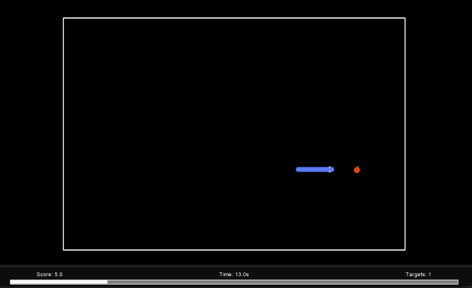

# Snake Persistence Task

This PsychoPy-based Snake task is designed to assess behavioral persistence in relation to Coping Self-Efficacy (CSE). The task provides clear, interpretable feedback so persistence can be measured consistently across participants.

## Run (PsychoPy)
1. Keep the folder structure intact (do **not** move `main.py` out of the project folder).
2. Open PsychoPy (Coder).
3. Open `main.py`.
4. Click **Run**.

Controls:
- Arrow keys: move
- `E`: start (instructions / stage screen)
- `Esc`: quit

## What gets logged
Results are added to `data/snake_data.csv`.

Fields include:
- `participant_id`, `session_datetime`, `difficulty`
- `snake_length`, `score`, `score_per_ms`, `hits_per_ms`, `collisions_per_ms`, `target_hit`, `collisions`

## Easy things to change

### Stages / timing
Edit `snake_task/stages.py`.

Each stage is a `StageConfig(...)` with:
- `name`: label written to the log
- `duration_sec`: stage duration (seconds)
- `speed_cells_per_sec`: snake speed (higher = faster)
- `no_hit_respawn_sec`: if no target hit occurs for this long, the target respawns

### Core gameplay + visuals
Edit `config.py`.

- `GRID_SIZE`: size of snake segments and movement step (bigger = larger snake/target)
- `START_LENGTH`: starting snake length
- `LENGTH_GAIN_PER_TARGET`: how many segments are added per target
- `LENGTH_LOSS_ON_COLLISION`: how many segments are removed on collision (won’t go below `START_LENGTH`)
- `SCORE_HIT`, `SCORE_COLLISION`: scoring
- `COLLISION_COOLDOWN_SEC`: prevents repeated collision penalties too rapidly

Target size:
- `APPLE_SCALE`: visual scale of the target relative to `GRID_SIZE`

### Play area size (boxed walls)
Edit `config.py`.
- `USE_PLAY_AREA_BOX`: enable/disable the smaller arena
- `PLAY_AREA_CELLS_X`, `PLAY_AREA_CELLS_Y`: arena size in grid cells
- `PLAY_AREA_LINE_WIDTH`, `PLAY_AREA_LINE_COLOR`: wall outline styling

### Sprites (snake + target images)
Edit `config.py`.
- `USE_SPRITES`: enable/disable images (fallback to rectangles if off or missing)
- `SPRITES_DIR`: folder where images live (defaults to `<project>/images`)
- `SPRITE_*` settings: filenames for snake head/body/tail + target

### Pre-stage fixation (+)
Edit `config.py`.
- `SHOW_PRE_STAGE_FIXATION`: show a flashing fixation cross before each stage
- `PRE_STAGE_FIXATION_TOTAL_SEC`: how long it shows
- `PRE_STAGE_FIXATION_FLASH_SEC`: flash rate
- `PRE_STAGE_FIXATION_SIZE_PX`: bigger = larger `+`
- `PRE_STAGE_FIXATION_THICKNESS_PX`: bigger = thicker/brighter-looking lines

## Credits
Snake model assets by Clear_code (CC0): https://opengameart.org/content/snake-game-assets
